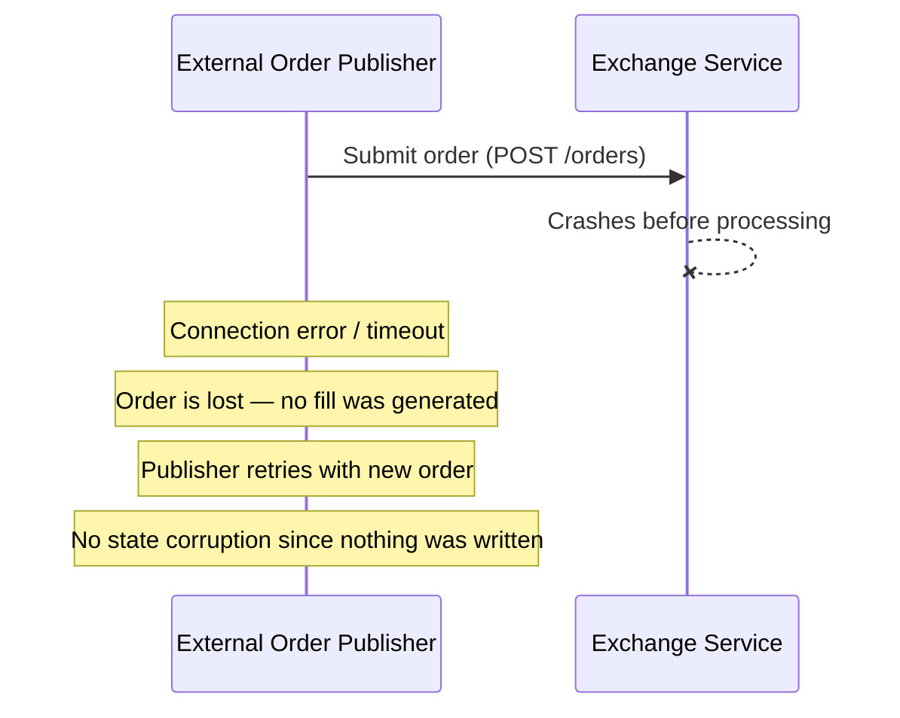
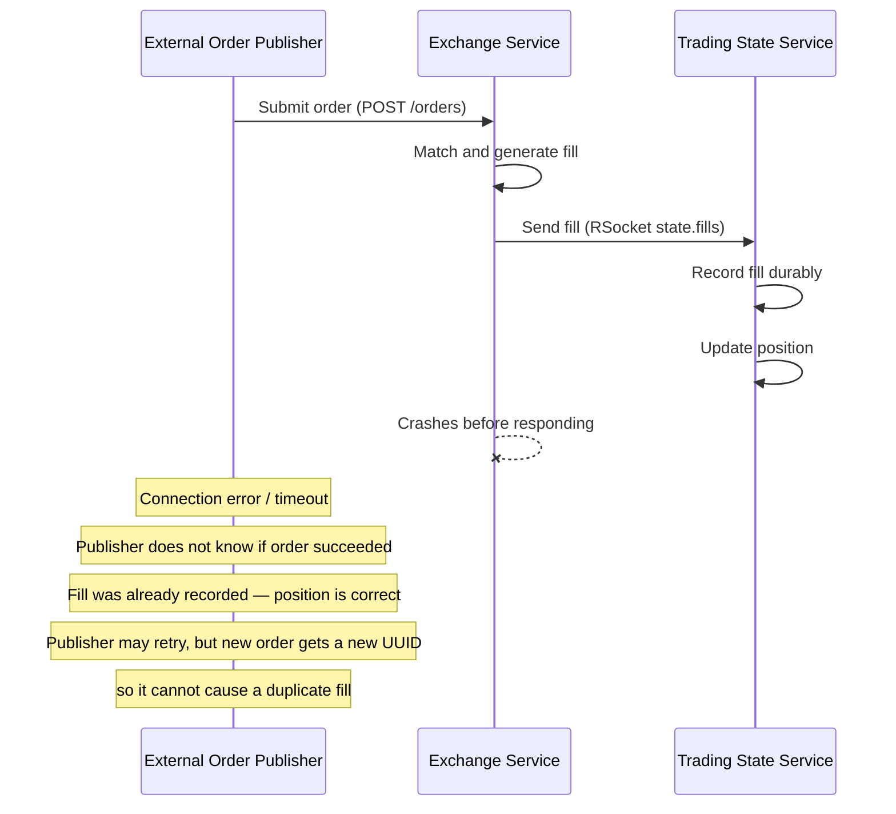
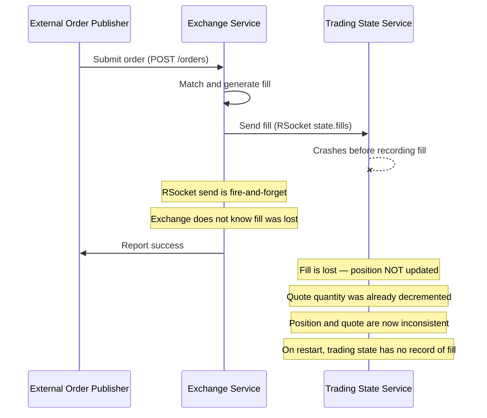
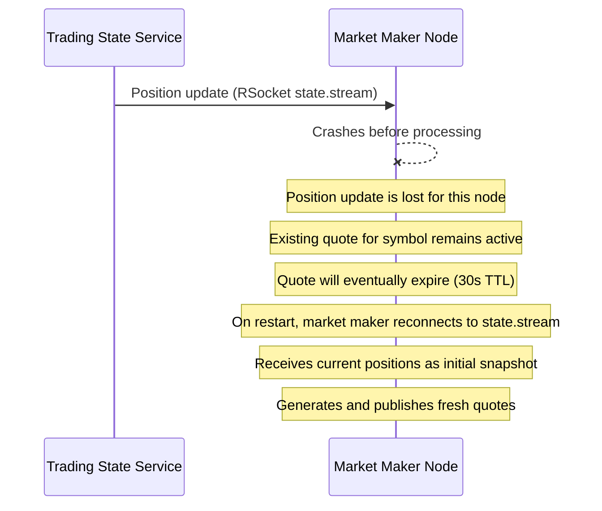
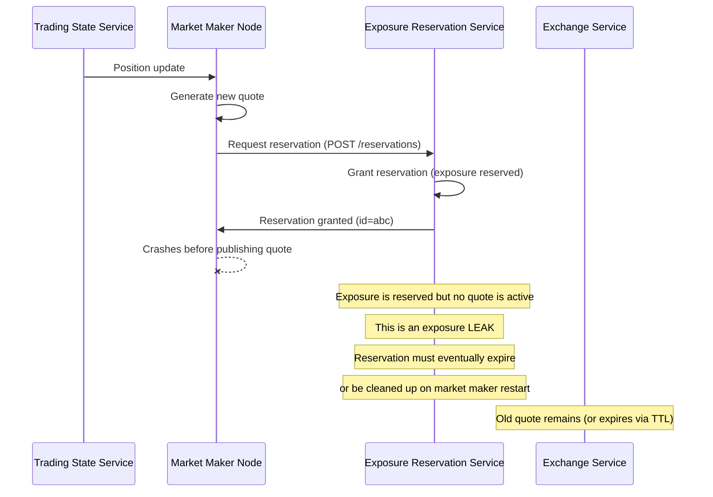
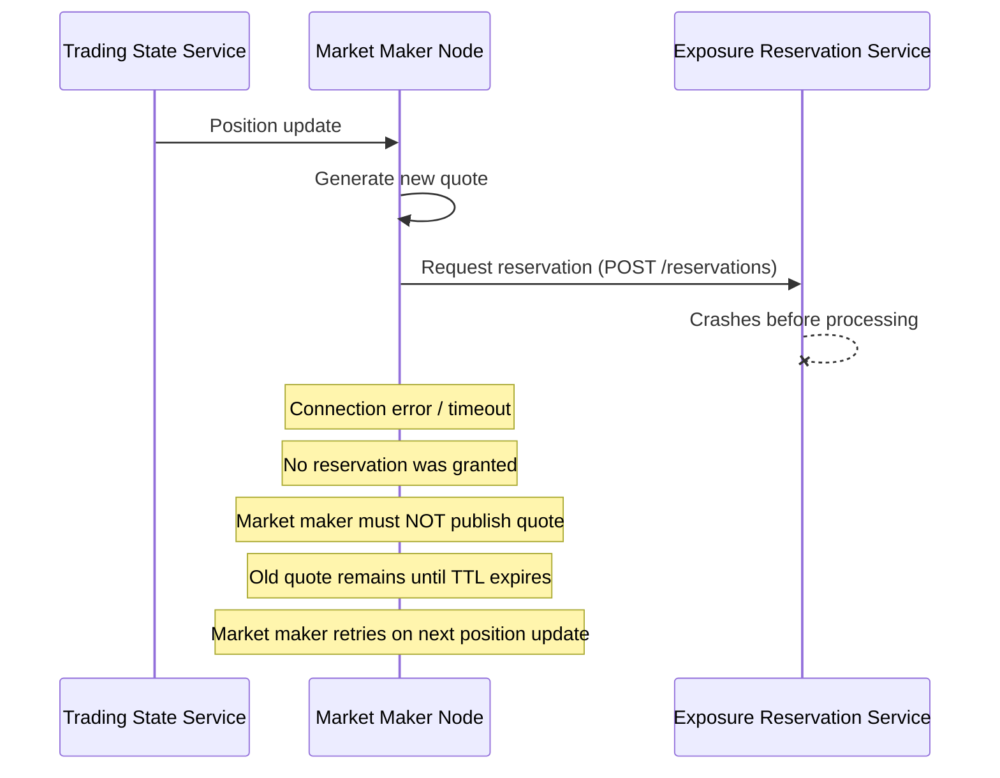
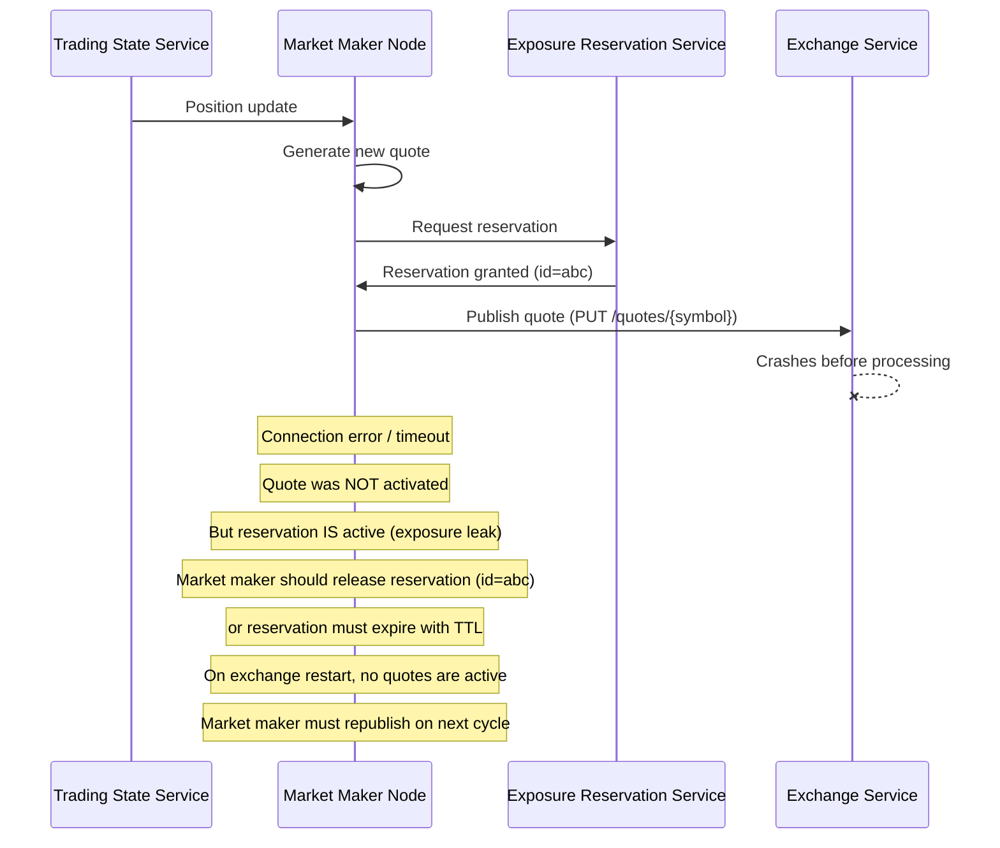
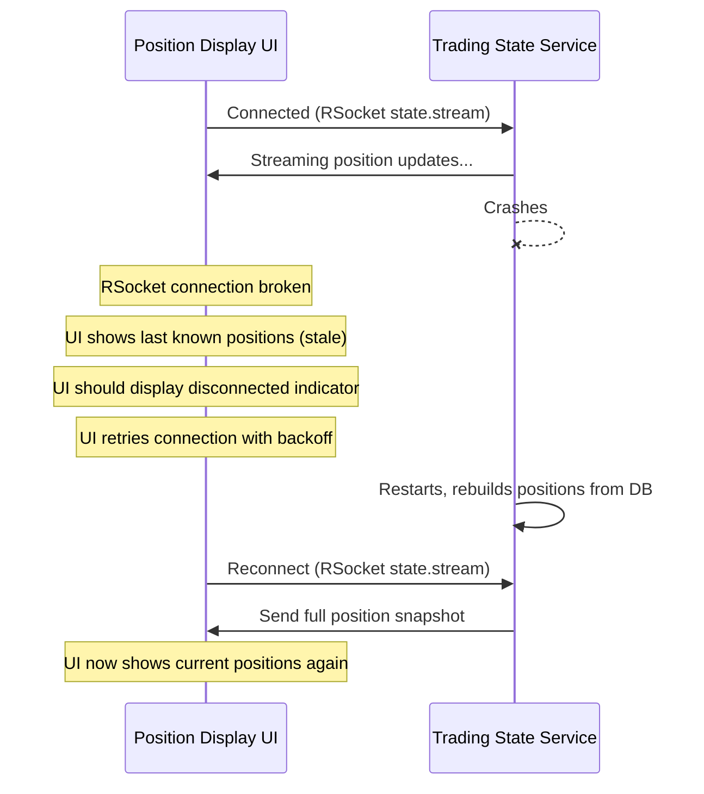
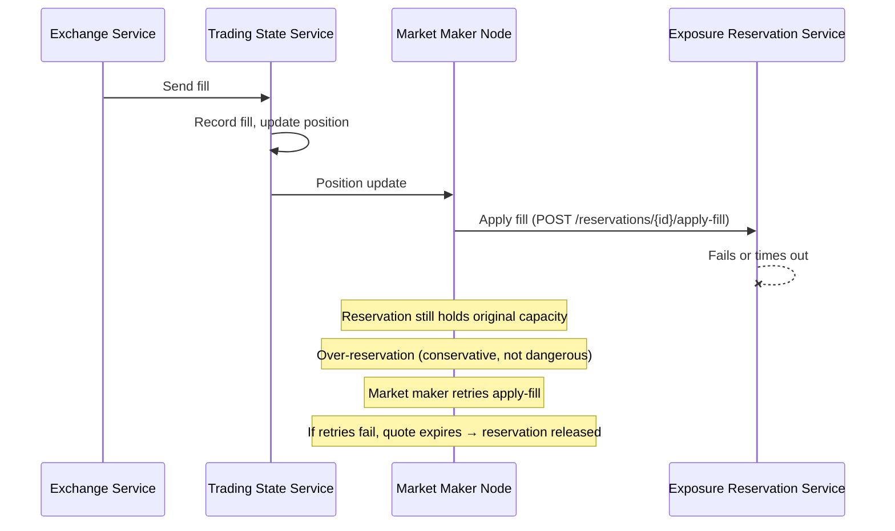
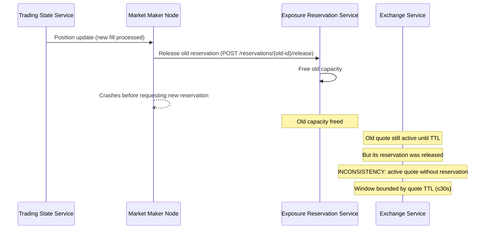

# Error Cases

Error cases are scenarios where a service or component goes down or fails unexpectedly. Client-side behavior (expired quotes, bad prices, partial fills, denied reservations) is documented in the workflow cases.

---

## Submitting External Orders

### Error Case 1: Exchange goes down before handling the order

**Outcome:** The order is simply lost. No fill was created, no position changed, and no exposure was affected. The external order publisher can retry by submitting a new order. Since the order never reached the matching engine, there is no risk of duplicate fills or inconsistent state.

---

### Error Case 2: Exchange goes down after sending the fill but before confirming to the publisher

**Outcome:** The fill was already sent to and recorded by the trading state service, so the position is correct. The publisher sees a timeout and doesn't know if the order succeeded. If it retries, the new order has a new UUID and is treated as a separate order — no duplication. The quote's remaining quantity was already decremented before the crash.

---

### Error Case 3: Trading state service goes down before handling the fill

**Outcome:** This is a critical inconsistency. The exchange already decremented the quote's remaining quantity, but the fill was never recorded. The position does not reflect the trade. Since RSocket fire-and-forget provides no delivery guarantee, the fill is lost. The quote will eventually expire (30s TTL), releasing its exposure, and the market maker will publish a new quote based on the (stale) position. This represents a known gap — a more robust design would use at-least-once delivery with idempotent fill recording.

---

## Updating Quote

### Error Case 4: Market maker goes down before handling the position update

**Outcome:** The position update is lost for this market maker instance. The currently active quote (if any) continues until its TTL expires. When the market maker restarts, it reconnects to `state.stream`, receives the full current position snapshot, and resumes publishing quotes based on the latest committed state.

---

### Error Case 5: Market maker goes down after sending reservation but before sending new quote

**Outcome:** Exposure capacity is reserved but never used — this is an exposure leak. The reservation stays active, reducing the available capacity for other quotes. The system needs a mechanism to handle this: either reservations should have their own TTL aligned with the quote TTL (30s), or the market maker must release orphaned reservations on restart.

---

### Error Case 6: Reservation service goes down before updating reservation

**Outcome:** The market maker receives an error when trying to reserve exposure. Per the authority boundaries, a quote must not become active without a granted reservation. The market maker does not publish the quote. The old quote (if any) remains until it expires. On the next position update or refresh cycle, the market maker retries.

---

### Error Case 7: Exchange service goes down before updating quote

**Outcome:** The reservation is granted but the quote never activates. The market maker should detect the failure and release the reservation. When the exchange restarts, it has no active quotes. The market maker will republish quotes on its next refresh cycle.

---

## Streaming Position Data Updates

### Error Case 8: Connected trading state service goes down

**Outcome:** The UI loses its real-time connection and shows stale data. It should indicate the disconnected state to the user and retry with exponential backoff. When the trading state service restarts, it rebuilds positions from PostgreSQL via Hazelcast MapStore. The UI reconnects and receives the full current snapshot.

---

## Exposure Lifecycle Errors

### Error Case 9: Fill arrives but reservation apply-fill fails

**Outcome:** The reservation still holds the original (pre-fill) capacity. This is a conservative over-reservation — it wastes capacity but does not violate the exposure limit. The market maker should retry. Even if retries fail, the quote eventually expires and the reservation is released.

---

### Error Case 10: Market maker crashes during quote replacement cycle

**Outcome:** There is a brief window where an active quote exists without a backing reservation. This violates the invariant that every active quote must have a reservation. The window is bounded by the quote's TTL (≤30 seconds). A safer approach would be to request the new reservation before releasing the old one.

---

## Full System Restart

### Error Case 11: Recovery after full system restart
```mermaid
sequenceDiagram
  participant pg as PostgreSQL
  participant state as Trading State Service
  participant reservation as Exposure Reservation Service
  participant exchange as Exchange Service
  participant maker as Market Maker Node
  Note over pg: PostgreSQL starts (data is durable)
  state->>pg: Start — Hazelcast MapStore eager-loads positions, fills
  reservation->>pg: Start — Hazelcast MapStore eager-loads reservations
  exchange->>pg: Start — Hazelcast MapStore eager-loads quotes (TTL may have lapsed during downtime)
  maker->>state: Connect to state.stream
  state->>maker: Initial snapshot (current Position + lastFill per symbol)
  Note over maker: AssignmentListener.bootstrapQuoteForNewlyAssigned: skip if a non-expired durable quote already exists; otherwise regen.
  maker->>maker: ProductionQuoteGenerator: expired survivor → treated as null → cold-start defaults (defaultQuantity, referencePrice=100)
  maker->>reservation: Request fresh reservation (atomically supersedes any pre-restart entry for this symbol)
  reservation->>maker: Grant / partial / deny
  maker->>exchange: Publish new quote (write-through to postgres)
  Note over maker: System resumes accepting orders against the refreshed quotes
```
**Outcome:** Each service rebuilds from durable storage via `MapStoreConfig.InitialLoadMode.EAGER`. There is no separate startup pass to "scan and expire" stale entries — quote expiry is handled lazily on read (the exchange's `FillOrderDispatcher` rejects orders against expired quotes, and `ProductionQuoteGenerator` treats an expired survivor as if no quote existed when it regenerates). Reservation exposure totals are derived on every `createReservation` call by summing `Reservation.grantedBid/grantedAsk` across the loaded `reservations` IMap, so the global capacity is correct as soon as the MapStore finishes its eager load. Market makers reconnect to `state.stream`, receive the position snapshot (with `lastFill`, enabling inventory-aware skew on the first regen), and resume quoting. End-to-end coverage lives in `ClusterError11RecoveryAfterFullSystemRestartTest` / `LocalError11RecoveryAfterFullSystemRestartTest`; the cluster variant intentionally does **not** restart `sts/zk` or `sts/postgres` because those are the durable layer being relied on.
