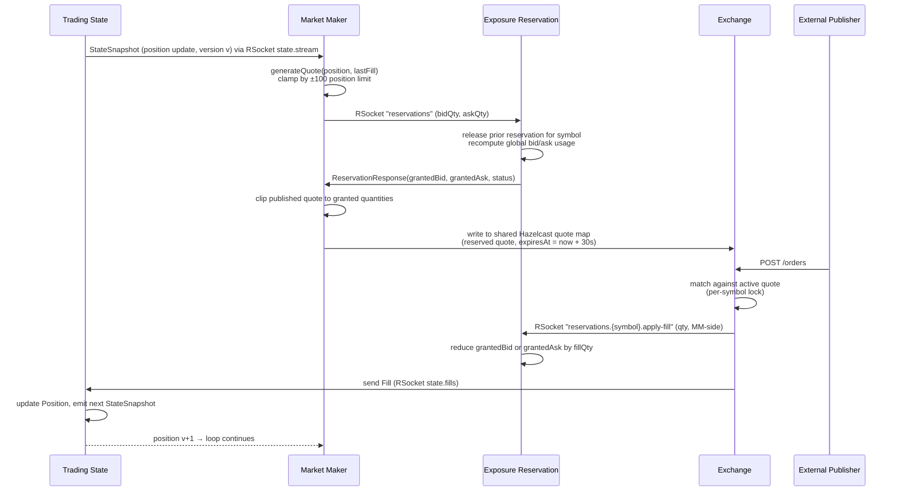
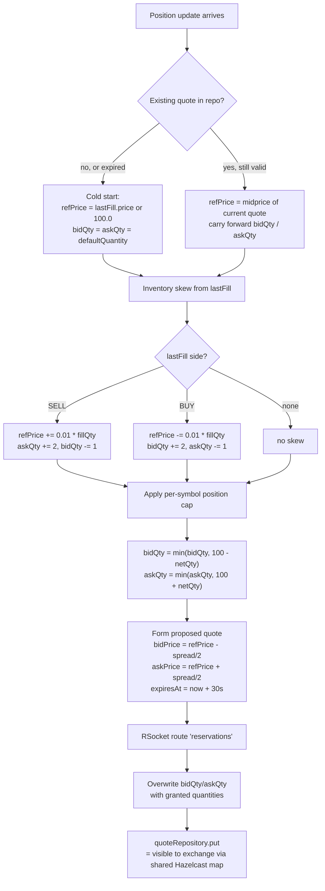
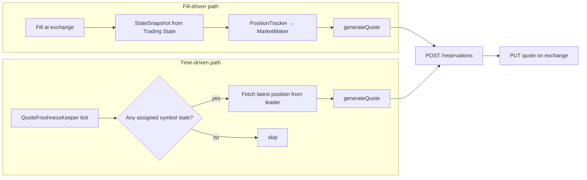
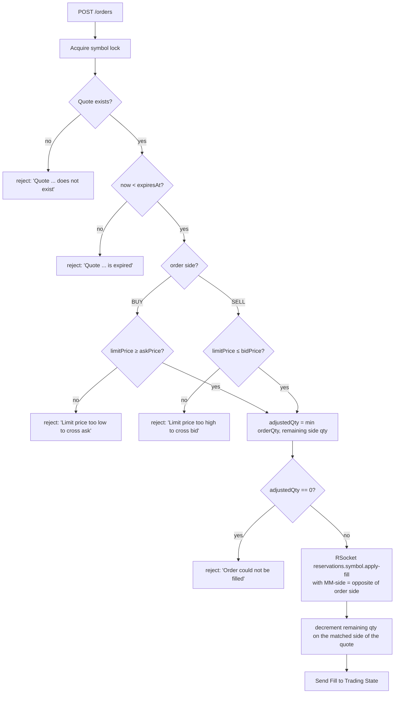

# System Logic

This document explains *how* the distributed market maker decides what to do, with a focus on the **exposure logic** that keeps the firm's total risk bounded. Component wiring lives in [`architecture.md`](architecture.md); per-scenario sequences live in [`workflows.md`](workflows.md) and [`error-cases.md`](error-cases.md).

---

## 1. Services and their responsibilities

| Service | Responsibility |
|---|---|
| **Exchange** | Owns active quotes. Matches incoming external orders against the active quote for the symbol, generates fills, decrements remaining quote quantity. |
| **Trading State** | Authoritative store of positions and fills. Re-publishes every position change as a `StateSnapshot` to all subscribers (UI over STOMP, MM pods over RSocket). |
| **Exposure Reservation** | Single global gatekeeper for firm-wide bid/ask exposure. Every quote a market maker wants to publish must first be reserved here. |
| **Market Maker (node)** | Generates quotes for the symbols it has been assigned. Reacts to `StateSnapshot` deltas and a periodic freshness tick. |
| **Cluster Coordinator** (inside MM) | ZooKeeper-elected leader that assigns each ticker to exactly one MM node. |

---

## 2. The exposure model

The system enforces two layers of risk control:

1. **Per-symbol position limit:** `|netQuantity| ≤ 100` for every symbol.
2. **Firm-wide exposure limit:** the sum of *reserved* bid quantities across *all* symbols ≤ 100, and the same separately for ask. This is enforced by the **Exposure Reservation Service** before any quote becomes live.

These are independent caps — a single symbol can exhaust the firm-wide bid budget on its own, and vice versa.

### 2.1 Why two sides (bid and ask) are tracked separately

A reservation books capacity for *both* sides of a quote:

- `grantedBid` reserves room for the position to grow (the MM is willing to buy this many).
- `grantedAsk` reserves room for the position to shrink (the MM is willing to sell this many).

A fill on the BUY side consumes bid capacity; a fill on the SELL side consumes ask capacity. The two budgets are independent — having no bid capacity left does not prevent reserving ask. This lets the firm continue to *reduce* a long position even when it has no remaining capacity to add to it.

Defined in `Reservation.java`:

```
Reservation(id, symbol, requestedBid, grantedBid, requestedAsk, grantedAsk, status)
```

### 2.2 Reservation status

Computed in `ExposureReservationService.determineStatus`:

| Status | Condition |
|---|---|
| `GRANTED` | Both sides fully granted (`grantedBid ≥ requestedBid` *and* `grantedAsk ≥ requestedAsk`). A side with `requestedX = 0` trivially counts as fully granted. |
| `DENIED`  | Both sides actually asked for capacity (`requestedBid > 0` and `requestedAsk > 0`) and both got zero. |
| `PARTIAL` | Anything else — typically one side full, the other clipped. Note: a request that only asks for one side and is fully denied on that side resolves to `PARTIAL`, not `DENIED`, because the unrequested side is not considered "denied". |

### 2.3 Per-side accounting

`createReservation` computes available capacity as:

```
availableBid = max(0, MAX_RESERVATION_LIMIT - sum(grantedBid across all reservations))
availableAsk = max(0, MAX_RESERVATION_LIMIT - sum(grantedAsk across all reservations))

grantedBid = min(requestedBid, availableBid)
grantedAsk = min(requestedAsk, availableAsk)
```

`MAX_RESERVATION_LIMIT = 100` is a single firm-wide knob applied to each side independently.

### 2.4 Quote replacement is atomic

When the MM submits a new reservation for a symbol that already has one, the service **releases the old reservation first** within the same `synchronized` block before computing availability:

```java
if (reservations.get(quote.symbol()).isPresent()) {
    release(quote.symbol());   // frees the prior bid/ask grant
}
// ... then compute availability and grant new amounts
```

This means a refresh of a 10/10 quote on a symbol does **not** double-count itself against the firm budget. Production code therefore never has to call `/release` explicitly during a normal refresh — it just submits a new reservation. The explicit `release` endpoint is used only by fault-injection paths.

---

## 3. The exposure lifecycle, end to end



Three things to notice:

1. **The MM never publishes a quote with quantities the reservation service didn't grant.** `ProductionQuoteGenerator` overwrites its proposed `bidQuantity`/`askQuantity` with `reservation.grantedBidQuantity()` / `grantedAskQuantity()` before saving the quote to the repository.
2. **Fills, not quotes, are what permanently consume exposure.** A reservation grant is bookkeeping; the firm-wide budget is only really spent when the exchange calls `apply-fill` after matching an order.
3. **There is no explicit release in the happy path.** Quote refresh atomically supersedes the previous reservation; fills decrement it; nothing else touches it.
4. **Quote publication is via a shared repository, not HTTP.** The `Repository<String, Quote>` is backed by a Hazelcast `IMap` that both the market-maker and the exchange read/write; `quoteRepository.put(reservedQuote)` is what makes a quote visible to `FillOrderDispatcher`.

---

## 4. Quote generation logic

`ProductionQuoteGenerator.generateQuote(position, lastFill)`:



### 4.1 Per-symbol position clamp

Before talking to the reservation service, each side is clamped so a fill at the published quantity cannot push the net position past ±100:

```java
int maxAllowedBid = max(0, 100 - position.netQuantity());  // room to buy more
bidQuantity = min(bidQuantity, maxAllowedBid);

int maxAllowedAsk = max(0, 100 + position.netQuantity());  // room to sell more
askQuantity = min(askQuantity, maxAllowedAsk);
```

So at `netQuantity = +100` the bid is forced to `0` (cannot grow long any further); the ask is allowed up to `200` by this clamp alone, though in practice the carry-forward / default-quantity logic upstream keeps the request much smaller, and the firm-wide bid/ask caps of 100 still apply at the reservation step.

### 4.2 Spread

`marketmaker.target-spread` (default `0.10`) is split evenly around the reference price. `bidPrice` is floored at `0.01`, and `askPrice` is floored at `bidPrice` so the spread can never invert.

### 4.3 Quote TTL

Every published quote carries `expiresAt = now + 30_000`. The exchange refuses to fill orders past this timestamp (`FillOrderDispatcher` raises `OrderValidationException("Quote ... is expired")`). The 30s TTL is the contract that prevents a stuck MM from leaving a stale price live indefinitely.

---

## 5. Two triggers for quote generation

| Trigger | Source | Purpose |
|---|---|---|
| **Fill-driven** | `PositionTracker` consumes `state.stream` over RSocket; `MarketMaker.handlePosition` calls `generateQuote` whenever a new-version snapshot arrives for an assigned symbol. | React to actual trading activity — re-skew, re-quantity, refresh TTL. |
| **Time-driven** | `QuoteFreshnessKeeper` ticks every `marketmaker.quote-refresh-interval-ms` (default 10s). | Refresh quotes whose `expiresAt - now < quote-stale-threshold-ms` (default 15s) even if no fill has arrived. |

The freshness keeper exists because in quiet markets there is no `state.stream` event to re-trigger quoting; without it, the 30s TTL would lapse and the exchange would reject every subsequent order, deadlocking the pipeline.



Note: `QuoteFreshnessKeeper` intentionally bypasses `MarketMaker.handlePosition` so it doesn't pollute the per-symbol version tracker (which is fill-ordering state, not refresh state).

### 5.1 Out-of-order suppression

`MarketMaker.newVersion` tracks the highest position `version` seen per symbol and only forwards a snapshot when `incoming > prev`. That means **equal and older versions are both discarded** — a re-delivery of the same version on a `state.stream` re-subscribe will not re-trigger quoting.

---

## 6. Exchange-side fill logic

`FillOrderDispatcher.dispatchOrder` runs entirely inside a per-symbol `synchronized` lock so that concurrent orders against the same quote serialize.



Key invariants enforced here:

- **No over-fills.** Per-symbol monitor + `min(orderQty, remainingQty)` means two concurrent orders against the same quote can never together fill more than the published quantity (`workflows.md` "Concurrent orders on same quote").
- **The MM's side is the opposite of the order's side.** An incoming BUY consumes the ask (the MM is selling). The reservation `apply-fill` is invoked with the *MM's* side, so `grantedAsk` is the one decremented.

---

## 7. Cluster assignment and the symbol-sharding invariant

Symbols are sharded across MM nodes by the cluster `Coordinator` (ZooKeeper-elected leader):

- Each ticker is assigned to **exactly one** MM node at any given time.
- The leader node intentionally holds no assignments — it coordinates only.
- Assignments are read by each node from its own znode under `/marketmaker/assignments/{node}`.

This single-writer invariant is what makes the per-symbol reasoning in this document safe: only one node ever calls `generateQuote` for a given symbol at a time, so the `quoteRepository.put` on a market-maker node and the reservation grant for that symbol cannot interleave across nodes.

If assignments shift mid-flight (e.g. n3 dies, its symbols reassign to n4):
1. n4 picks up the new symbol via `AssignmentListener`.
2. n4 bootstraps a fresh quote (cold-start branch in `generateQuote`).
3. That new reservation atomically supersedes any prior reservation n3 left behind on the reservation service.

---

## 8. State-stream multicast

`TradingStateService` publishes a single in-process `Sinks.Many<StateSnapshot>` to two independent transports:

- **STOMP over WebSocket** at `/topic/positions` — for the browser UI.
- **RSocket request-stream** on route `state.stream` — for MM pods.

Both consumers see byte-identical snapshots since they share the sink. Only the leader replica of trading-state actually emits to the WebSocket bridge; non-leader replicas keep their sink dormant. This means MM nodes always read the leader's view of position, which is the same view operators see in the UI.

---

## 9. Recovery logic (summary)

Detailed sequence diagrams live in [`error-cases.md`](error-cases.md); the load-bearing invariants are:

- **Durable storage.** Every service's repository is backed by PostgreSQL via Hazelcast `MapStore`. On startup, `loadAll` restores positions, fills, reservations, and quotes before traffic resumes.
- **Quote TTL bounds the damage.** No quote can outlive its `expiresAt`. If an MM crashes mid-refresh, the worst outcome is a 30s gap during which the exchange rejects orders with "Quote is expired" — never a fill against a stale price.
- **Reservation supersession is atomic.** A returning MM that re-issues a reservation for one of its symbols atomically replaces any orphan reservation left behind by its previous incarnation; the firm-wide budget self-heals on the next refresh tick.
- **Idempotent fills.** External orders carry a UUID. A retried order has a *new* UUID and is treated as a separate order — there is no path where the same fill is recorded twice.