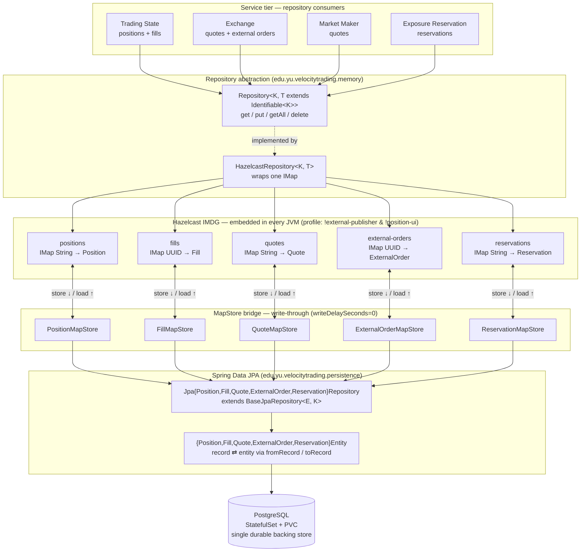
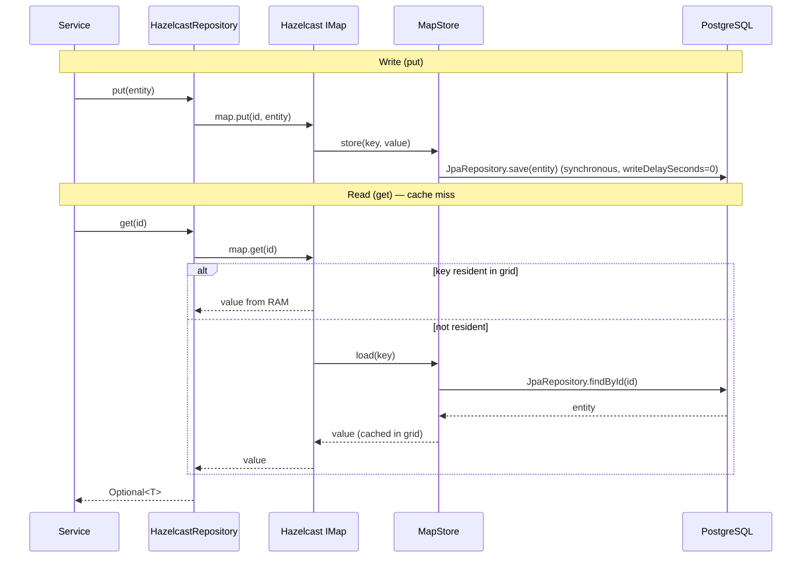

# Memory Architecture

Velocity Trading keeps all hot trading state in an **embedded Hazelcast in-memory
data grid (IMDG)** that lives inside every stateful service JVM, and backs each
distributed map with **PostgreSQL** through a write-through `MapStore`. Services
never touch the database or Hazelcast directly — they go through a generic
`Repository<K, T>` abstraction, so the same code path runs against the live grid
in production and against simple in-memory stubs in tests.

The result is partitioned, replicated, durable state shared across the cluster
without a separate cache tier: reads are served from RAM, writes flush
synchronously to Postgres, and a cold start eager-loads everything back from
Postgres.

## Layered view

## How the pieces fit

**Repository abstraction** — `Repository<K, T extends Identifiable<K>>` exposes
`get / put / getAll / delete`. In production every map is wrapped by a
`HazelcastRepository<K, T>` (configured in `HazelcastConfig`). Tests swap in
in-memory implementations (`StaticPositionRepository`, `StaticQuoteRepository`,
`InMemoryReservationRepository`) behind the same interface, so service logic is
storage-agnostic.

**Hazelcast IMDG** — five `IMap`s hold the live state, keyed as shown above
(`positions`, `quotes`, and `reservations` are keyed by symbol; `fills` and
`external-orders` by `UUID`). The grid is embedded in every stateful service, so
all members form one cluster and share the same partitioned data. Key map
settings from `HazelcastConfig`:

- **No eviction** (`EvictionPolicy.NONE`) — the full working set stays resident.
- **`backupCount = 2`** — three copies of each partition survive two simultaneous
  member failures (the worst case during the rolling restart in error case 11).
- **`InitialLoadMode.EAGER`** — on startup each map reloads from Postgres via
  `loadAllKeys` / `loadAll` before the service reports ready.

**MapStore bridge (write-through)** — each `*MapStore` implements Hazelcast's
`MapStore` interface. Writes flush synchronously (`writeDelaySeconds = 0`, batched
at `writeBatchSize = 100`, `writeCoalescing = true`); reads on a miss load from
Postgres. Each store converts between the in-memory record (`Position`, `Fill`, …)
and its JPA entity using `fromRecord` / `toRecord`.

**Spring Data JPA + PostgreSQL** — `BaseJpaRepository<E, K>` (a
`@NoRepositoryBean` extension of `JpaRepository`) provides standard CRUD; one
concrete repository and one `IdentifiableEntity` exist per type. PostgreSQL runs
as a `StatefulSet` with a PVC and is the single durable backing store for every
map, which is what makes full-system-restart recovery possible.

## Read and write paths

