# Workflows

## Submitting External Orders
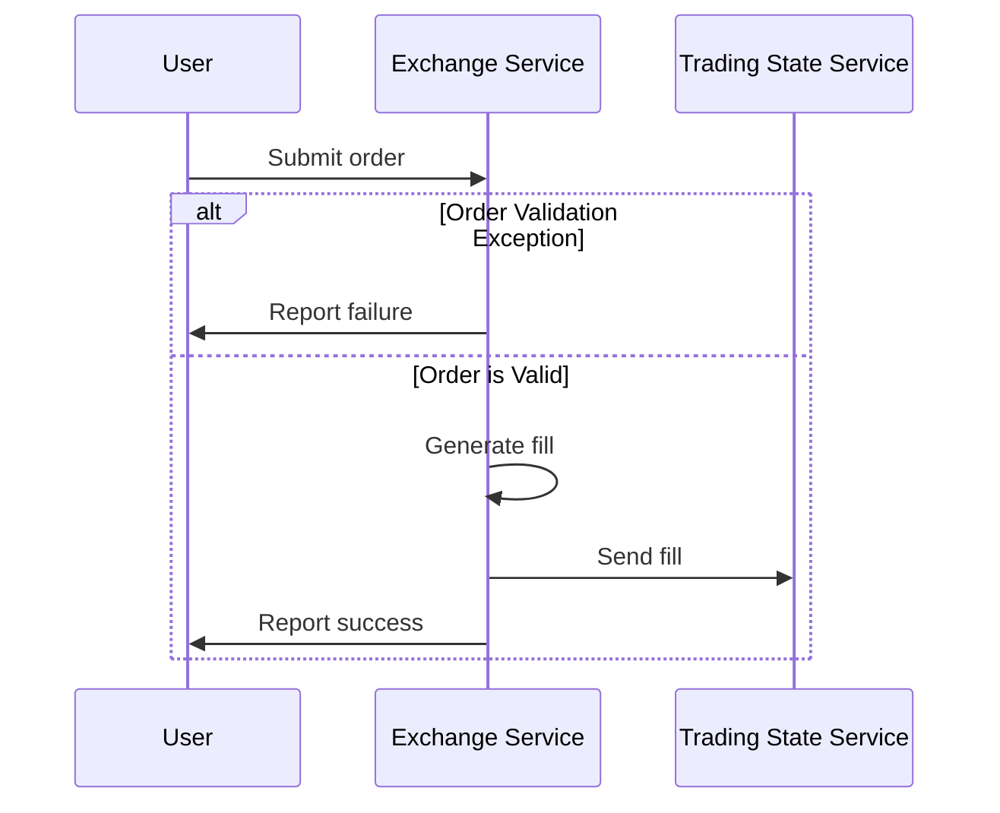

### Order submitted against an expired quote
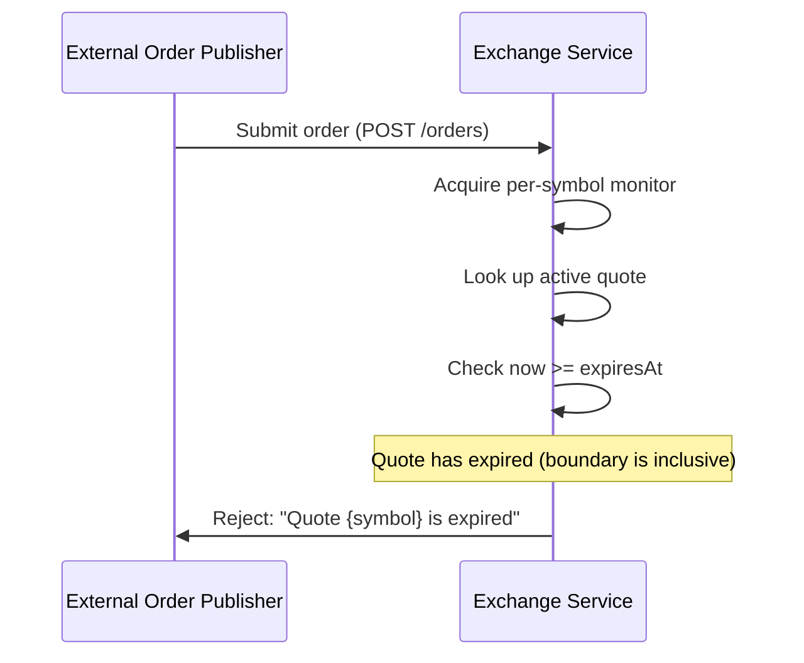
**Outcome:** `FillOrderDispatcher` rejects with `OrderValidationException` whenever `System.currentTimeMillis() >= quote.expiresAt()` — equality counts as expired. `ExchangeServiceAdvice` maps the exception to HTTP 400. The publisher may retry once a fresh quote is published.

### Order quantity exceeds remaining quote quantity (partial fill)
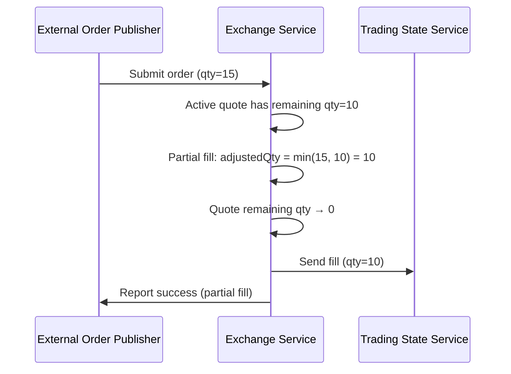
**Outcome:** The order is partially filled against the remaining quote quantity. The fill reflects only the actually executed quantity. The quote's remaining quantity is decremented accordingly.

### Concurrent orders on same quote
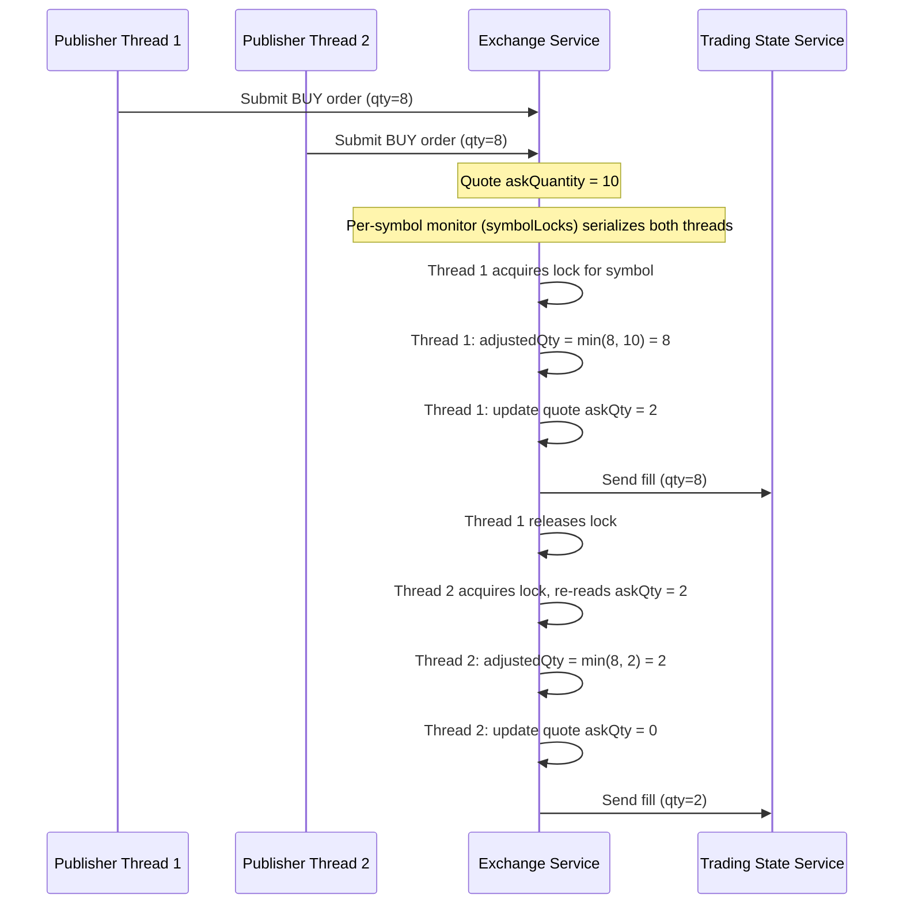
**Outcome:** `FillOrderDispatcher` serializes all order handling for a given symbol through a per-symbol `synchronized` monitor (`symbolLocks`). The second thread always observes the already-decremented remaining quantity, so its fill is clamped to whatever is left (possibly zero, in which case `OrderValidationException("Order could not be filled")` is thrown). Over-fills cannot occur.

---

## Updating Quote
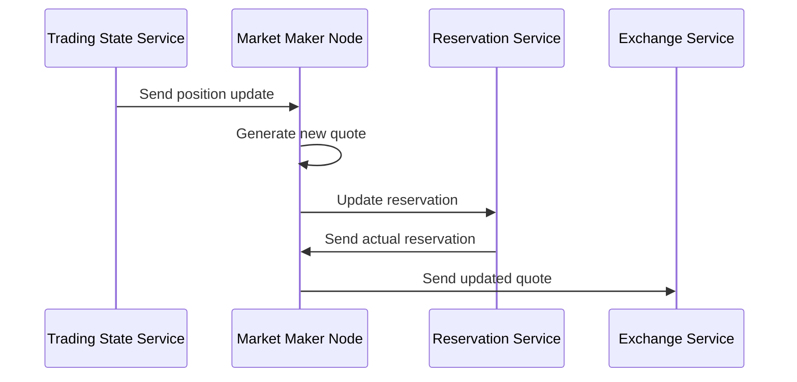

### Reservation is partially granted
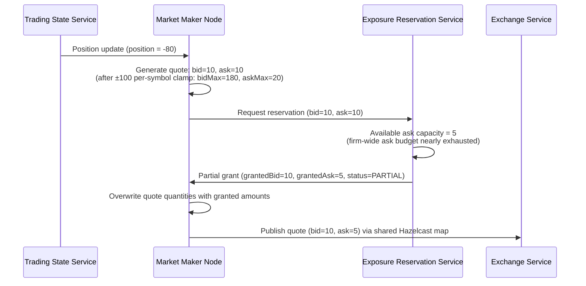
**Outcome:** Every reservation request carries both sides. When the firm-wide budget on one side is short, the reservation service grants only what is available on that side. `ProductionQuoteGenerator` always overwrites the proposed `bidQuantity` / `askQuantity` with `reservation.grantedBidQuantity()` / `grantedAskQuantity()` before saving, so the published quote can never exceed what was granted.

### Reservation denied entirely
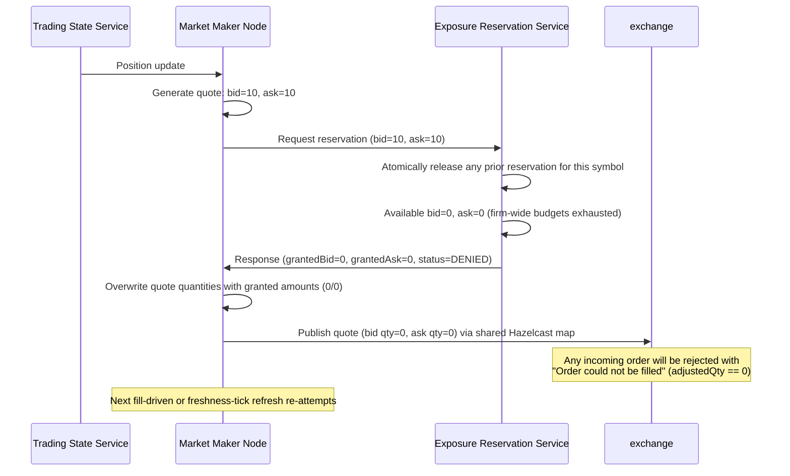
**Outcome:** `ProductionQuoteGenerator` does **not** branch on `status` — it unconditionally writes a quote with the granted quantities (zero on both sides here) to the shared quote map. The prior reservation for this symbol was already released atomically inside `createReservation`. The exchange still sees an active, unexpired quote, but every incoming order fails the `adjustedQty == 0` check in `FillOrderDispatcher` and is rejected with `"Order could not be filled"`. The MM tries again on the next position update or, in a quiet market, on the next `QuoteFreshnessKeeper` tick.

### Stale position update arrives after a newer one
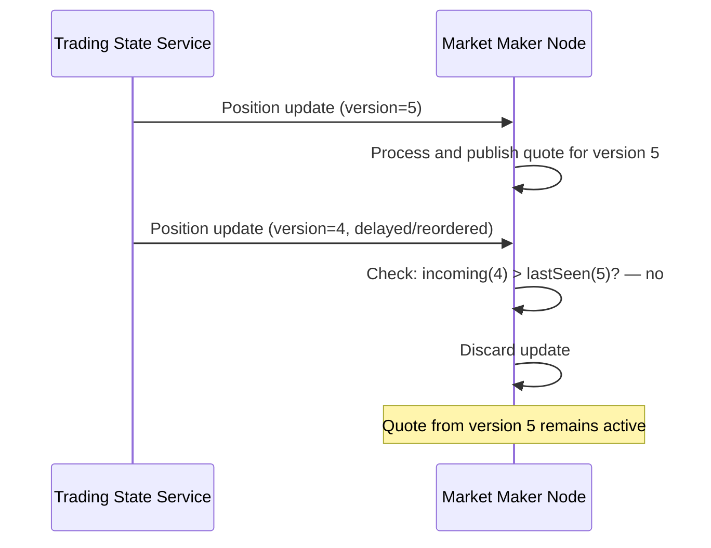
**Outcome:** `MarketMaker.newVersion` only accepts a snapshot when `incoming > prev`, so **both older and equal-version snapshots are discarded** — a re-delivery of the same version after a `state.stream` reconnect will not re-trigger quoting either. This prevents stale or duplicated snapshots from overriding the freshest known position.

### Quote expires before it can be refreshed
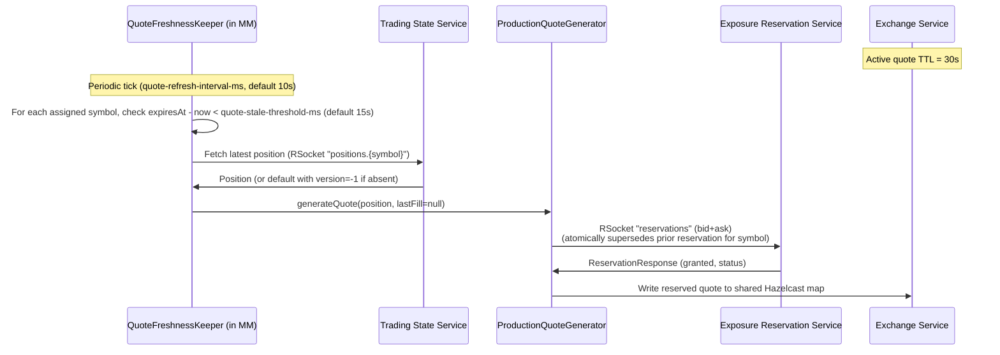
**Outcome:** `QuoteFreshnessKeeper` polls each MM-owned symbol on a fixed interval and refreshes any quote whose `expiresAt - now` is under `marketmaker.quote-stale-threshold-ms` (default 15s) — including quotes already past expiry or missing entirely. It bypasses `MarketMaker.handlePosition` (so the fill-ordering version tracker isn't polluted) and instead fetches a fresh position from the leader and calls `QuoteGenerator.generateQuote` directly. The new reservation request **atomically supersedes** the prior one for that symbol — no explicit release call is issued in the non-fault path. The explicit `reservations.{symbol}.release` route only fires from fault-injection paths (`ProductionQuoteGenerator` Error Case 10), and fills are netted via `apply-fill` rather than full release.

---

## Streaming Position Data Updates

The `trading-state` service publishes position updates over two independent transports:

- **STOMP over SockJS WebSocket** (`/ws`) — used by the browser-based Position Display UI (`static/index.html`). Clients receive an initial snapshot via `SUBSCRIBE /app/positions.snapshot` and live deltas via `SUBSCRIBE /topic/positions`.
- **RSocket request-stream** on route `state.stream` (TCP port 7000) — used by **market-maker pods** (`PositionTracker.java`) to consume the same updates internally.

Both transports are fed from the same `Sinks.Many<StateSnapshot>` multicast publisher inside `TradingStateService`, so all subscribers see identical data.

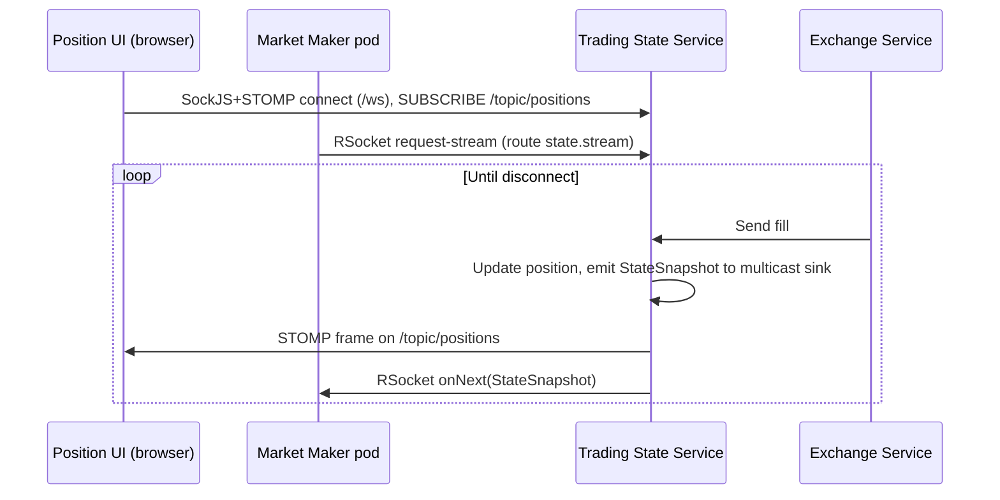

### UI connects but no positions exist yet
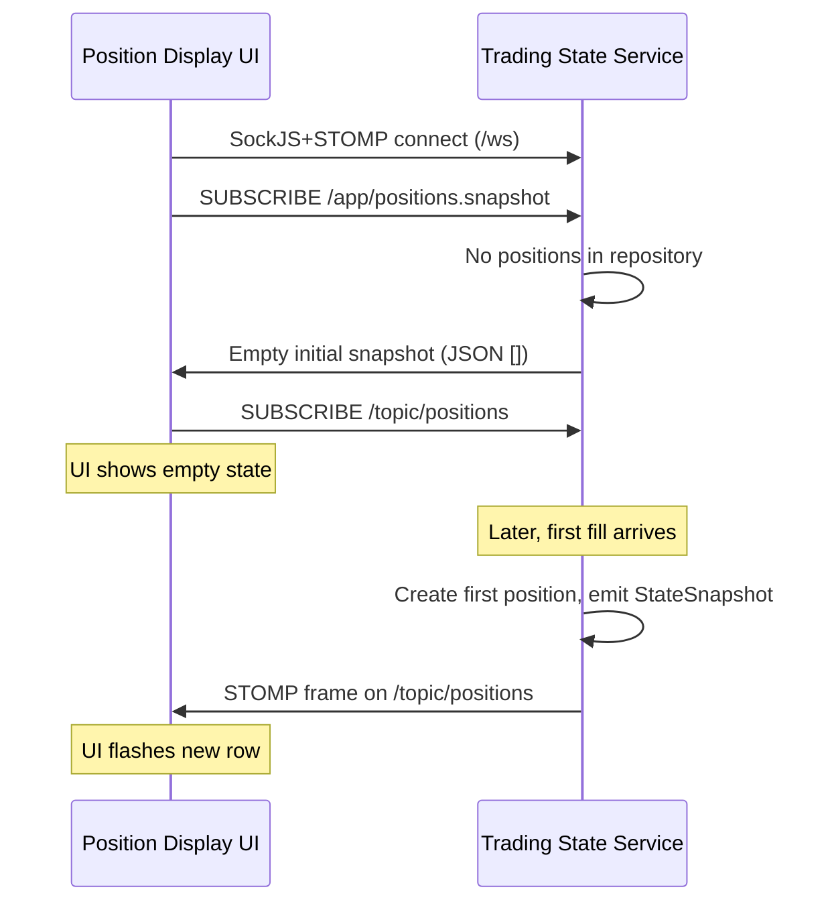
**Outcome:** The UI handles the empty state gracefully and updates dynamically as positions are created.

### Multiple UI clients connected simultaneously
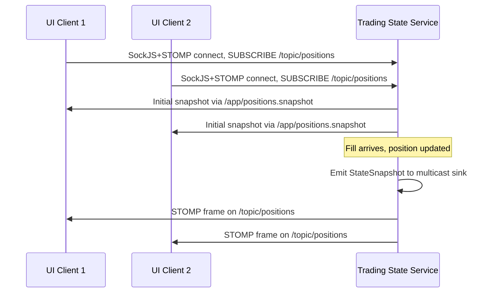
**Outcome:** The multicast `Sinks.Many<StateSnapshot>` fans out to every active STOMP subscriber (and every RSocket subscriber on `state.stream`). All UI clients see consistent, real-time position data.
