# Workflows

## Submitting External Orders
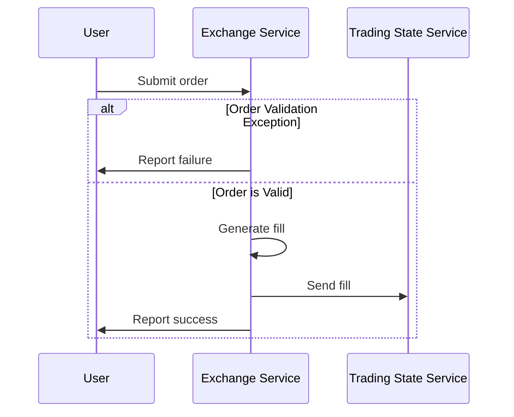

### Order submitted against an expired quote
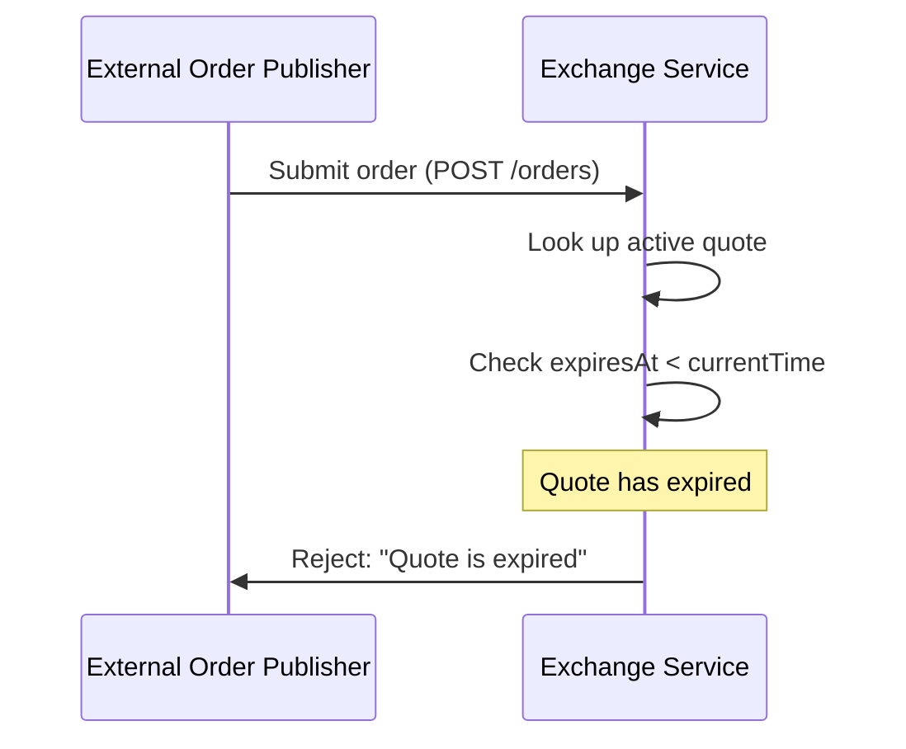
**Outcome:** The exchange checks `expiresAt` before matching. Expired quotes are never filled. The publisher receives a 400 error and may retry later when a fresh quote is available.

### Order quantity exceeds remaining quote quantity (partial fill)
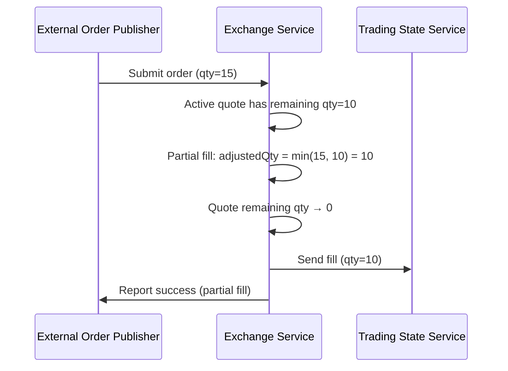
**Outcome:** The order is partially filled against the remaining quote quantity. The fill reflects only the actually executed quantity. The quote's remaining quantity is decremented accordingly.

### Concurrent orders on same quote
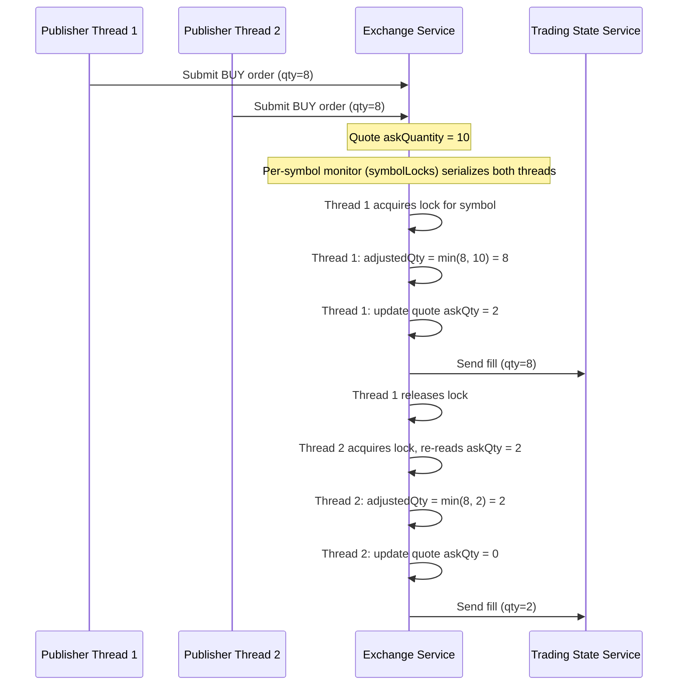
**Outcome:** `FillOrderDispatcher` serializes all order handling for a given symbol through a per-symbol `synchronized` monitor (`symbolLocks`). The second thread always observes the already-decremented remaining quantity, so its fill is clamped to whatever is left (possibly zero, in which case `OrderValidationException("Order could not be filled")` is thrown). Over-fills cannot occur.

---

## Updating Quote
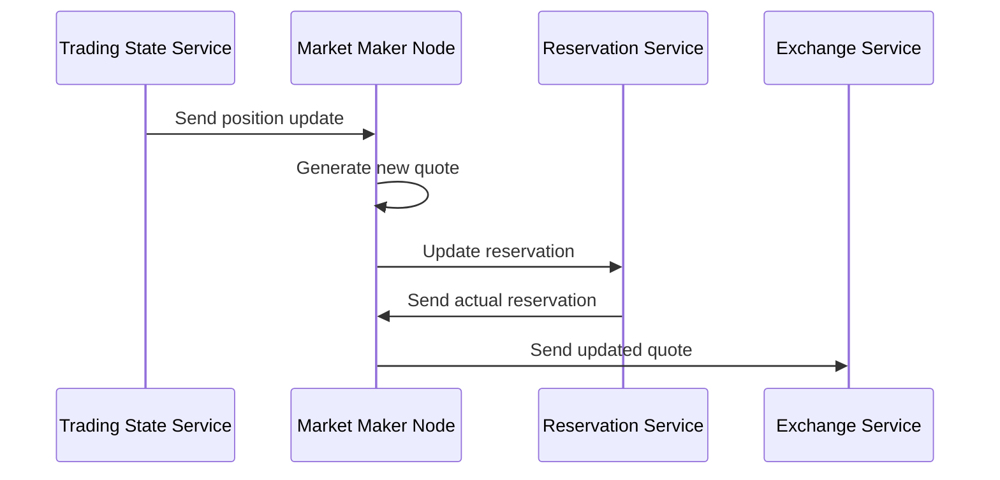

### Reservation is partially granted
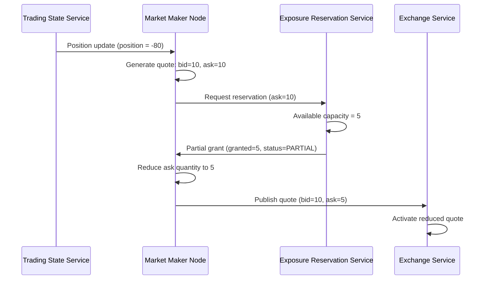
**Outcome:** When insufficient exposure capacity exists, the reservation service grants only what is available. The market maker deterministically reduces the quote quantity to match and publishes a smaller quote. This prevents exposure limit violations while still providing some liquidity.

### Reservation denied entirely
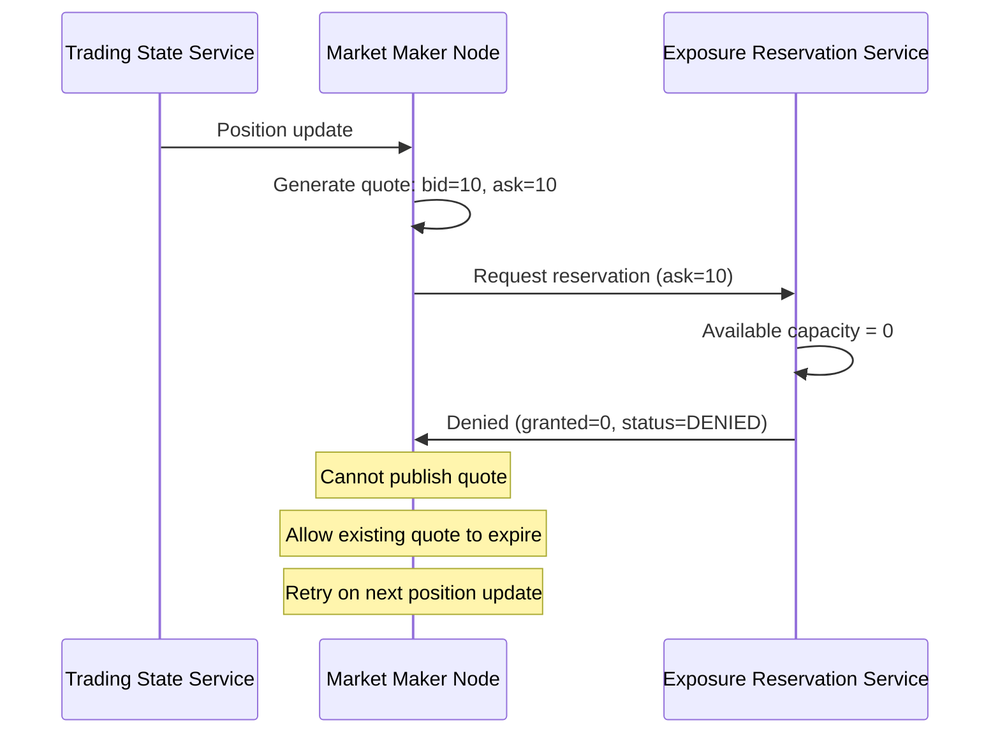
**Outcome:** No exposure capacity is available. The market maker cannot publish a quote for this symbol. The existing quote (if any) expires naturally. The market maker will retry when it receives the next position update or when capacity becomes available.

### Stale position update arrives after a newer one
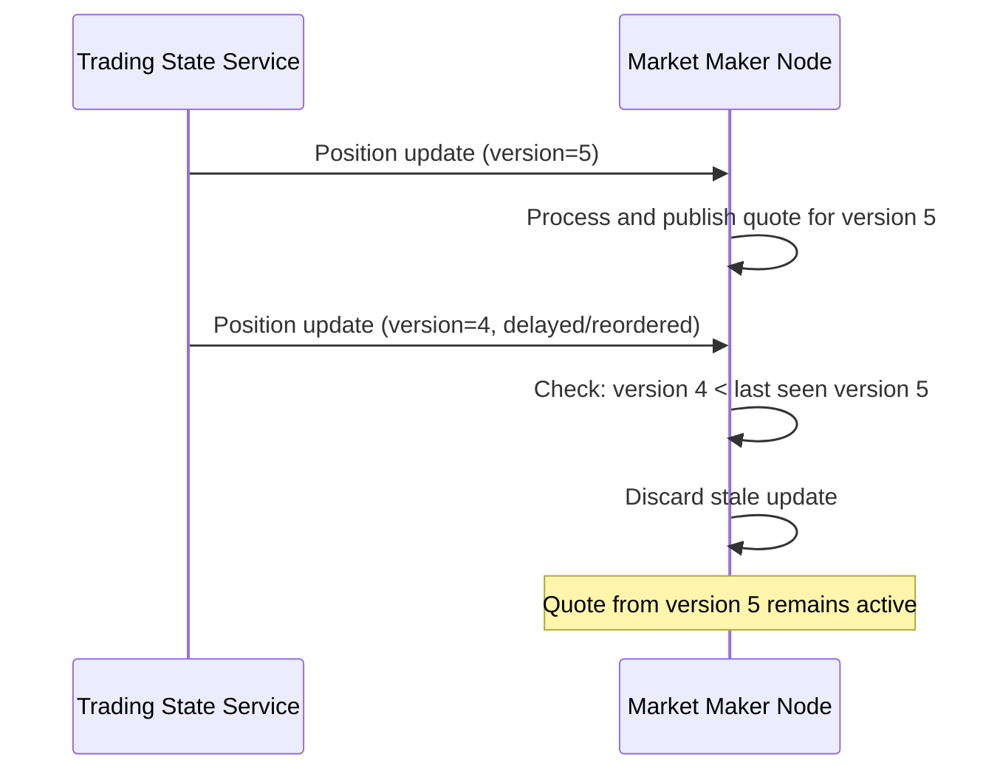
**Outcome:** The market maker tracks the last processed position version per symbol. Updates with older versions are discarded to prevent stale quotes from overriding newer state.

### Quote expires before it can be refreshed
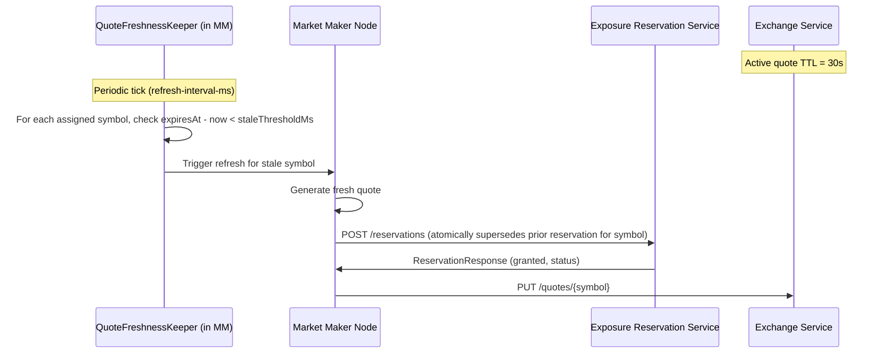
**Outcome:** `QuoteFreshnessKeeper` polls each MM-owned symbol on a fixed interval and refreshes any quote whose `expiresAt - now` is under `marketmaker.quote-stale-threshold-ms` (default 15s). The new reservation request **atomically supersedes** the prior one for that symbol on the reservation service — no explicit release call is issued in the non-fault path. The explicit `POST /reservations/{symbol}/release` only fires from fault-injection paths (`ProductionQuoteGenerator`) and on fill via `apply-fill`.

---

## Streaming Position Data Updates

The `trading-state` service publishes position updates over two independent transports:

- **STOMP over SockJS WebSocket** (`/ws`) — used by the browser-based Position Display UI (`static/index.html`). Clients receive an initial snapshot via `SUBSCRIBE /app/positions.snapshot` and live deltas via `SUBSCRIBE /topic/positions`.
- **RSocket request-stream** on route `state.stream` (TCP port 7000) — used by **market-maker pods** (`PositionTracker.java`) to consume the same updates internally.

Both transports are fed from the same `Sinks.Many<StateSnapshot>` multicast publisher inside `TradingStateService`, so all subscribers see identical data.

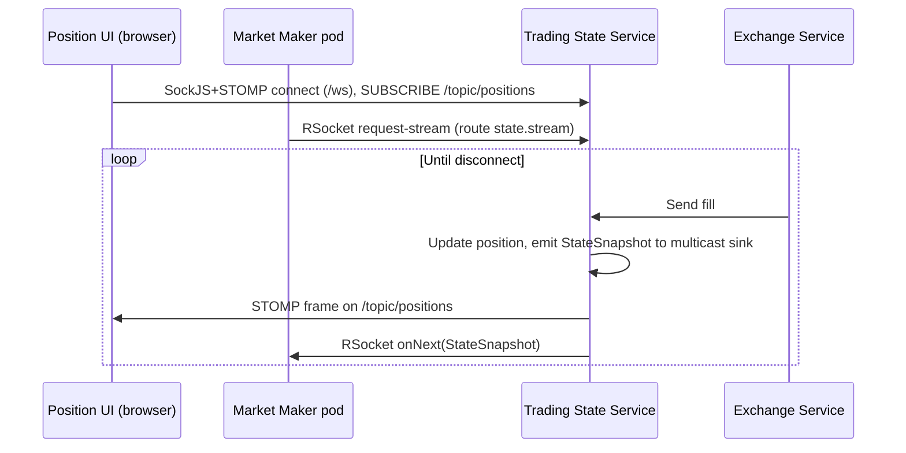

### UI connects but no positions exist yet
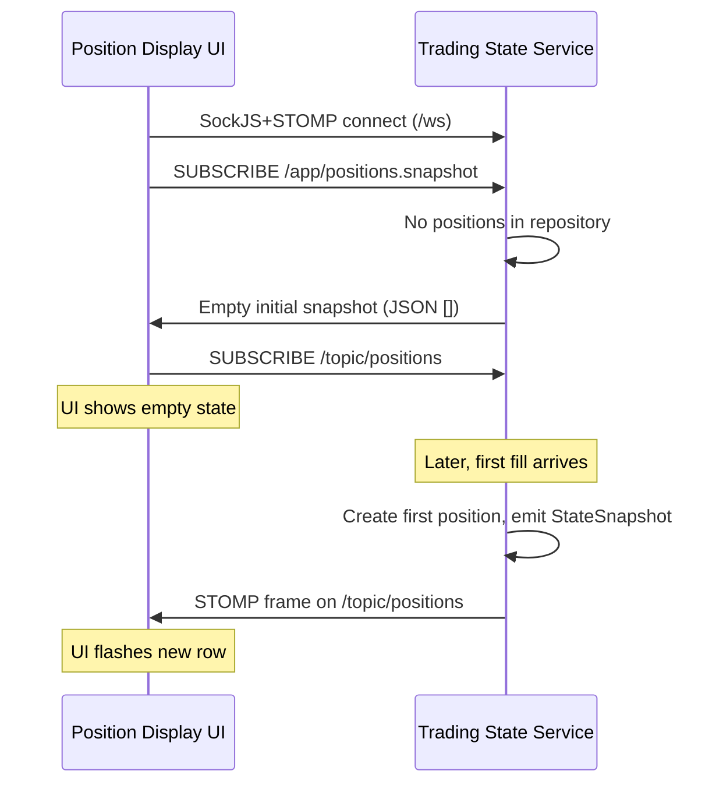
**Outcome:** The UI handles the empty state gracefully and updates dynamically as positions are created.

### Multiple UI clients connected simultaneously
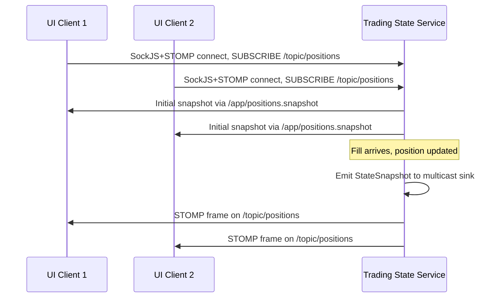
**Outcome:** The multicast `Sinks.Many<StateSnapshot>` fans out to every active STOMP subscriber (and every RSocket subscriber on `state.stream`). All UI clients see consistent, real-time position data.
